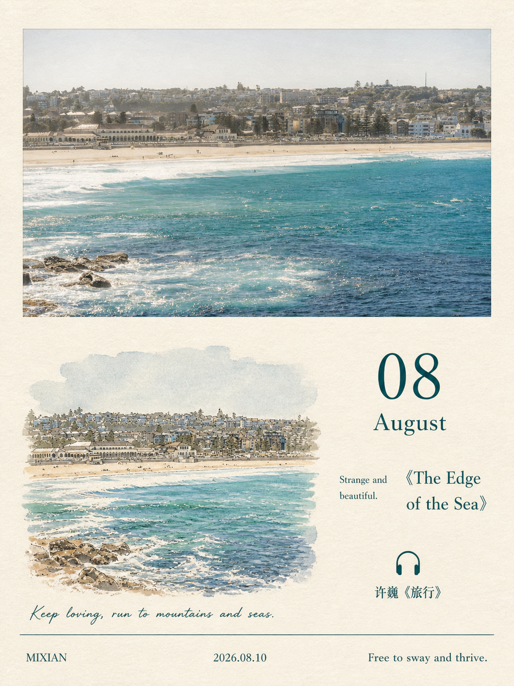
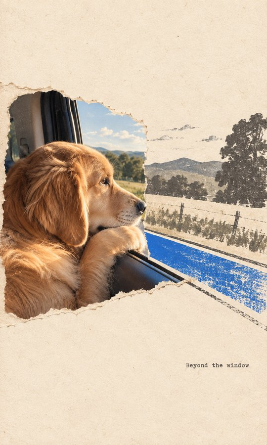

# Frame Forge

**将照片与灵感，转化为有风格的作品。**

一个面向 Codex 的图片创作 Skill。直接指定风格，或先看示例图再选择；Frame Forge 加载对应的视觉规则和提示词，让当前会话的内置生图工具完成创作。

## 四种风格

| 1 · 极简纸刊 | 2 · 月历明信片 |
| :---: | :---: |
|  |  |
| 大留白、纸张肌理、小主体与单一亮色 | 完整照片、水彩、月份与书影音 |

| 3 · 照片抽象编辑 | 4 · 实景纸感拼贴 |
| :---: | :---: |
|  |  |
| 照片搭配源于场景关系的抽象面板 | 真实摄影、插画、结构性色彩与撕纸边界 |

以上为上游作者样例，来源见[来源与许可证](references/sources.md)，不是本项目生成效果测试。部分为历史样例：第三张含当前规则不再使用的色卡，第四张为横向构图；实际输出按当前规则与用户要求执行。

## 安装

将本仓库链接交给 Codex，要求安装仓库根目录的 `frame-forge` skill：

```text
请安装 https://github.com/LycheeAILab/frame-forge 的根目录 Skill。
```

或手动克隆到你的 Codex skills 目录：

```bash
git clone https://github.com/LycheeAILab/frame-forge.git ~/.codex/skills/frame-forge
```

Windows PowerShell：

```powershell
git clone https://github.com/LycheeAILab/frame-forge.git "$env:USERPROFILE\.codex\skills\frame-forge"
```

如果设置了自定义 `CODEX_HOME`，请安装到其 `skills/frame-forge` 下。安装后在新任务中使用；实际生成需要该会话提供可调用的生图工具。

## 使用

先选择风格：

```text
用 $frame-forge 展示四种风格的示例图，我选好后再生成。
```

上传照片后指定风格：

```text
用 $frame-forge 把这张照片做成实景纸感拼贴，保留人物与远处山脉的关系。
```

用文字创作极简纸刊：

```text
用 $frame-forge 做一张关于雨天旧书店的极简纸刊海报。
```

制作月历：

```text
用 $frame-forge 把这张照片做成九月明信片，署名 Lychee，其他页脚留空。
```

## 生成方式与当前状态

- **内置生图**：优先使用用户当前会话的可调用工具，不需要在本 skill 中配置 API key。不会根据客户端名称推断 image2 权限，也不会声称内置工具未披露的模型身份。
- **内置风格提示词**：选定风格后自动在内部使用，用户直接获得成品图片，交付不包含提示词或参数配方。
- **工具不可用**：提示当前暂时无法生成，保留风格选择，不用提示词替代图片。
- **风格选择**：直接匹配名称或编号，未指定则展示上方这四张随包固定示例（支持时以两行两列展示），客户回复编号后再生成。选择页不额外生图。
- **验证状态**：已做 skill 结构、资源和引用检查；尚未进行四种风格的端到端生图测试。

## 来源与使用范围

Frame Forge 将四套上游风格整合到统一选择与生成流程中，保留作者署名和许可证。

- [GC Minimal Zine Poster](https://github.com/LiamGvchi/gc-minimal-zine-poster) — MIT。
- [Photo to Monthly Zine Postcard](https://github.com/shenchangyi/photo-to-monthly-zine-postcard) — MIT。
- [Photo Abstract Editorial](https://github.com/ZzzLc0405/photo-abstract-editorial) — 以其许可证及单独授权为准。
- [Gathered Scenes Zine](https://github.com/Zeejay0/gathered-scenes-zine-skill) — 以其许可证及单独授权为准。

后两种按维护者声明已有的作者商业授权集成；该授权不自动转授给仓库使用者。本仓库不对全部内容统一授予 MIT 许可。详见[来源、授权与修改](references/sources.md)。
