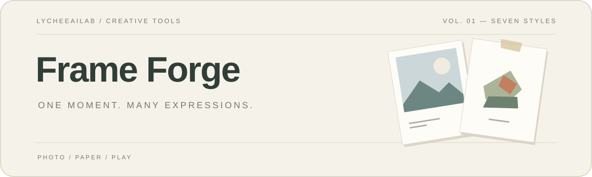
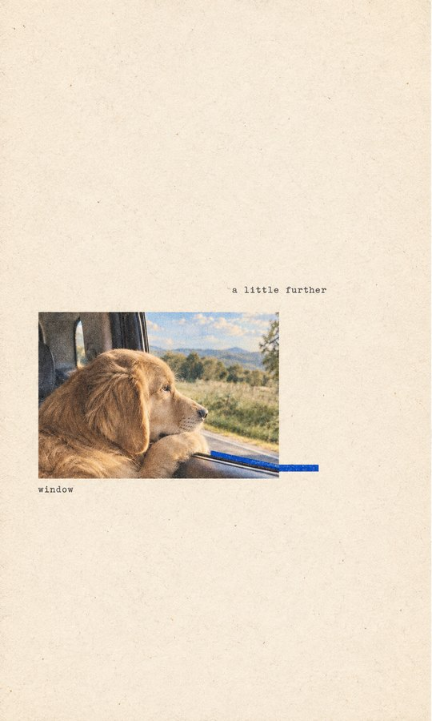
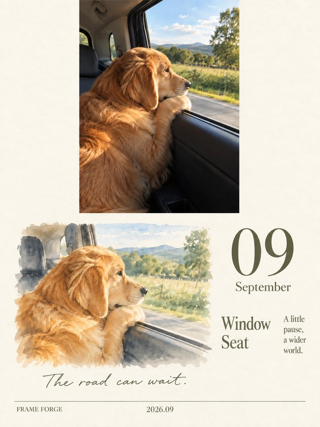
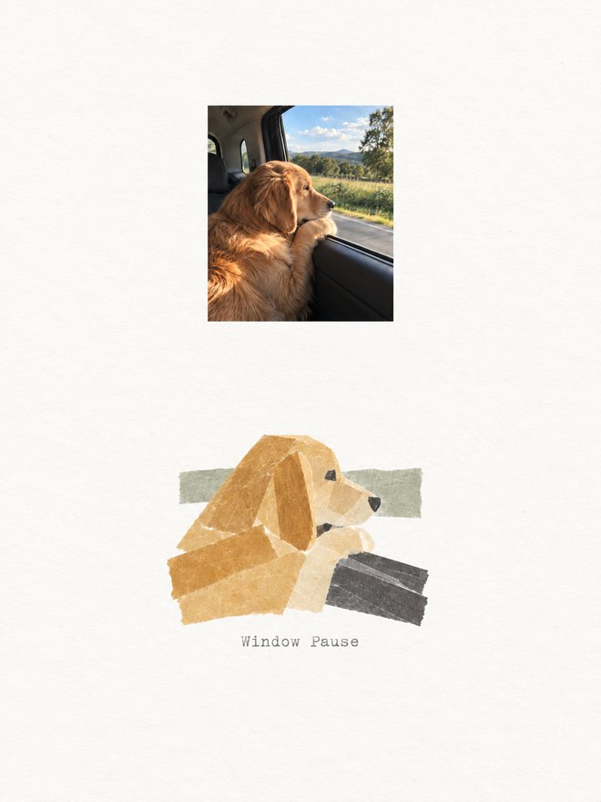
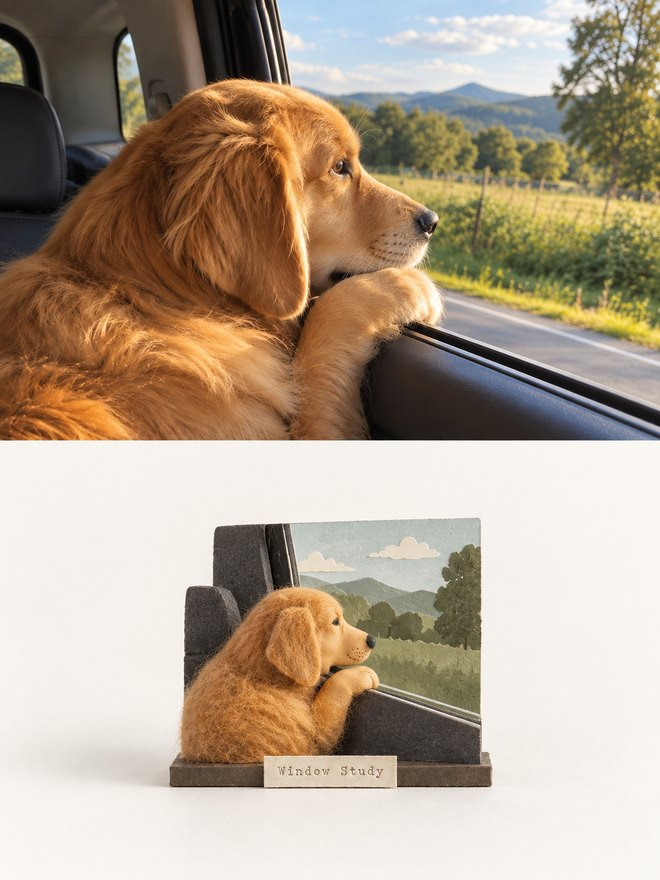
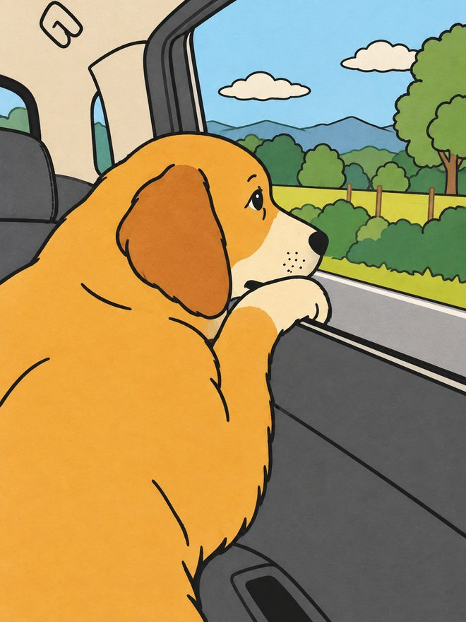

<div align="center">



# Frame Forge

### 把照片与灵感，变成值得收藏的一页。

从一张照片或一句灵感开始，选择喜欢的视觉风格。<br />
让纸刊、拼贴与微缩舞台，成为你的下一张作品。

[](#install)
[](#gallery)
[](#features)

[核心能力](#features) · [风格画廊](#gallery) · [使用方式](#usage) · [安装](#install)

</div>

---

<a id="features"></a>

## ✨ 核心能力

| | 能力 | 你提供 | Frame Forge 交付 |
| :---: | :--- | :--- | :--- |
| 🎨 | 看图选风格 | 风格编号或名称 | 按所选风格生成的作品 |
| 📷 | 照片再创作 | 一张源照片 | 保留主体特征的全新视觉表达 |
| 💡 | 灵感成画 | 一句话描述场景 | 极简纸刊或手工微缩双联 |
| 🧩 | 逐张制作 | 多张照片，选择纸胶带拼贴 | 每张照片对应一张独立作品 |

> [!TIP]
> 不用整理提示词。上传照片，说「展示风格示例」，选好后直接生成成品图片。

<a id="gallery"></a>

## 🖼️ 风格画廊

同一只金毛，同一个车窗，七种表达。点击图片查看预览。

<table>
  <tr>
    <td align="center" width="33%">
      <a href="assets/previews/minimal.jpg"></a><br>
      <strong>01 · 极简纸刊</strong><br>
      <sub>大留白 · 纸纹 · 单一亮色</sub>
    </td>
    <td align="center" width="33%">
      <a href="assets/previews/monthly.jpg"></a><br>
      <strong>02 · 月历明信片</strong><br>
      <sub>原照片 · 水彩 · 月份手记</sub>
    </td>
    <td align="center" width="33%">
      <a href="assets/previews/abstract.jpg"></a><br>
      <strong>03 · 照片抽象编辑</strong><br>
      <sub>摄影 · 抽象关系 · 干净排版</sub>
    </td>
  </tr>
  <tr>
    <td align="center">
      <a href="assets/previews/gathered.jpg"></a><br>
      <strong>04 · 实景纸感拼贴</strong><br>
      <sub>真实摄影 · 撕纸边缘 · 结构性色彩</sub>
    </td>
    <td align="center">
      <a href="assets/previews/masking-tape.jpg"></a><br>
      <strong>05 · 纸胶带拼贴</strong><br>
      <sub>纸胶带 · 柔和配色 · 手工触感</sub>
    </td>
    <td align="center">
      <a href="assets/previews/miniature-diptych.jpg"></a><br>
      <strong>06 · 手工微缩双联</strong><br>
      <sub>黏土毛毡 · 微缩舞台 · 上下双联</sub>
    </td>
  </tr>
  <tr>
    <td align="center">
      <a href="assets/previews/marker-sketch.jpg"></a><br>
      <strong>07 · 马克笔简笔画</strong><br>
      <sub>原图构图 · 粗黑线 · 纯色平涂</sub>
    </td>
    <td colspan="2" align="center">保留熟悉的姿态，换一种手绘表达。<br><sub>上传照片，选择第七种即可开始。</sub></td>
  </tr>
</table>

<sub>Frame Forge 实际生成示例 · 预览图已压缩，适合在线浏览 · 点击查看，按编号选择。</sub>

<a id="usage"></a>

## 🧭 一句话开始创作

安装后，上传照片，用自然语言告诉 Frame Forge 你想要什么。

**先看风格，再决定**

```text
用 $frame-forge 展示风格示例图，我选好后再生成。
```

**把照片做成手工作品**

```text
用 $frame-forge 把这张照片做成第五种「纸胶带拼贴」。
```

**从一句灵感开始**

```text
用 $frame-forge 做一张雨天旧书店的极简纸刊海报。
```

**让场景变成微缩舞台**

```text
用 $frame-forge 的第六种风格，把这张照片做成手工微缩双联。
```

<a id="install"></a>

## 📦 安装

### Codex

把下面这句话发给 Codex：

```text
请安装 https://github.com/LycheeAILab/frame-forge 的根目录 Skill。
```

安装后，在新任务中输入 `$frame-forge` 开始使用。生成作品需要当前会话支持内置生图工具。

<details>
<summary>手动安装 · macOS / Linux / Windows</summary>

macOS / Linux：

```bash
git clone https://github.com/LycheeAILab/frame-forge.git ~/.codex/skills/frame-forge
```

Windows PowerShell：

```powershell
git clone https://github.com/LycheeAILab/frame-forge.git "$env:USERPROFILE\.codex\skills\frame-forge"
```

设置了自定义 `CODEX_HOME` 时，安装到其 `skills/frame-forge` 目录。安装后在新任务中使用。

</details>

<a id="tips"></a>

## ✅ 创作建议

第七种「马克笔简笔画」保留源图构图、动作与主体位置，用粗黑手绘线和大色块完成风格迁移。可直接说：「用 $frame-forge 把这张照片做成第七种马克笔简笔画。」

| 你的想法 | 可以这样说 |
| :--- | :--- |
| 从一句话开始 | 做一张关于雨天旧书店的极简纸刊海报。 |
| 留住这个月 | 把照片做成九月明信片，署名 Lychee，其余页脚留空。 |
| 多张照片分别创作 | 每张照片单独做成纸胶带拼贴，不要合并。 |
| 把场景变成小舞台 | 用第六种，把照片中的场景做成手工微缩双联。 |

极简纸刊和手工微缩双联支持文字场景；其他风格使用源照片。纸胶带拼贴逐张输出独立的 3:4 作品。手工微缩双联采用上下等高结构，下半幅保留大面积留白。

<details>
<summary>生成与输出说明</summary>

- 使用当前会话的内置生图工具，无需在本 skill 中配置 API key。
- 提示词在内部使用，用户收到图片与简短说明。
- 选风格直接展示固定预览，不额外生成选择图。
- 内置工具不可用时说明暂时无法生成，不用提示词代替图片。
- 七种风格已完成单张示例生成与视觉检查，不承诺照片像素级一致。
- 打印规格以实际生成文件的像素和所需印刷尺寸为准。

</details>

---

<div align="center">
  <strong>Frame Forge</strong><br />
  <sub>Built with care by <a href="https://lab.lycheeai.com.cn/">LycheeAILab</a></sub>
</div>
